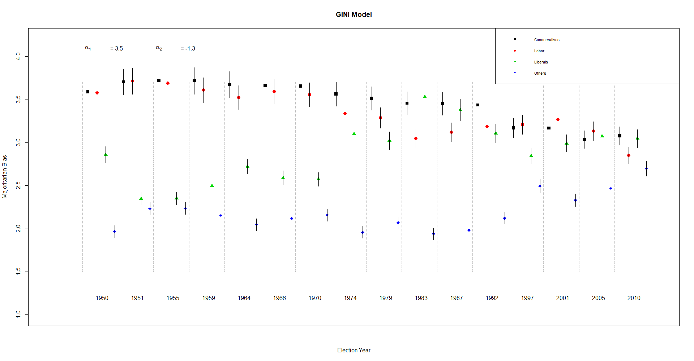
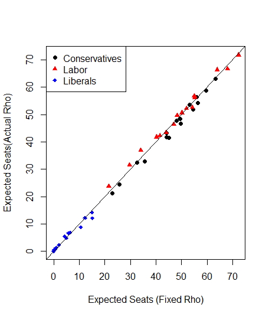
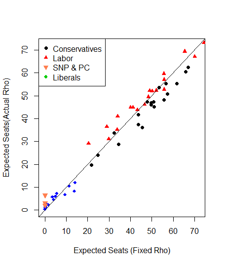
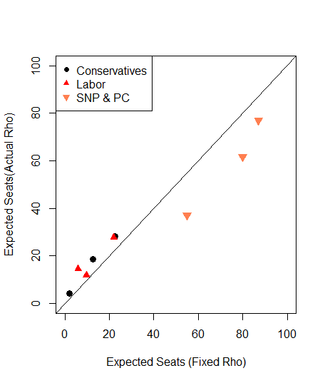

```{r setup, include=FALSE}
knitr::opts_chunk$set(echo = TRUE)
knitr::opts_chunk$set(fig.pos = "!H", out.extra = "")

```


# Abstract

Calvo and Rodden (2016) attempt to address the puzzle of multi-party competition in democracies by building an analytical model of the relationship between a party's territorial distribution of support and its vote-seat curve, and then use their model to analyze election results in the UK from 1950-2010. Their model shows an increase in majoritarian biases as the number of parties contesting an election goes up, that small parties are hurt when their vote is dispersed, and that large parties are hurt when their vote is concentrated. I was able to successfully replicate all aspects of their paper, including analysis outside of R using WinBugs. The last few years have been tumultuous in British politics, so I tested Calvo and Rodden's model on updated UK election data, looking specifically at the electoral fortunes of the Scottish National Party in the UK as a whole and specifically in Scotland. I found that Calvo and Rodden's model was able to determine both majoritarian and partisan bias, even for regional parties that don't contest districts due to being small, but don't contest districts by design, but the model struggled with calculating how many seats these parties would win. I also looked at election results in Scotland independent of other UK results, and found that the model often came to surprisingly different conclusions than looking at UK elections in general. ^[All analysis for this paper is available [here.](https://github.com/rmckenzie11/Replication_1006)]


# Intro

Calvo and Rodden are concerned that the consensus on elections in majoritarian democracies dismisses the impact of small parties.  Working from an outline of the rules governing the relationship between geographic distribution of support and legislative representation, first established by Gudgin and Taylor (1979), Calvo and Rodden empirically model the vote-seat curve of a party as a function of their geographic support. Their model sheds light on how dispersion and concentration effects election outcomes, often very unfairly.  


  I replicated Calvo and Rodden’s paper using code and data provided on the Harvard Dataverse. Code was cleaned and organized in R, and data was then piped into WinBUGS, where the model was built. The replicated code provided was a tremendous help, and the only issues I encountered were incorporating WinBUGS into my workspace. Due to lack of processing power, I did simplify the number of iterations per Markov chain.  


  One of the great advantages of Calvo and Rodden’s model is that it is purely empirical and can be applied to many different elections. This will be further discussed in the literature review, but since 2015, the model has been used to analyze elections in Switzerland, Massachusetts, Kenya, China, the UK, and Mexico. I was curious to see how their model would deal with regionalist parties like the Scottish National Party and Plaid Cymru (Wales). These parties don’t contest most seats in an election, but their extremely concentrated support means they win far more seats than their proportion of votes.  


  I updated the original UK election dataset to include results from the 2015, 2017, and 2019 general elections. In those elections, the SNP and PC substantially outperform the Liberal party, so I grouped the Liberals in with minor parties and measured the majoritarian bias of the regionalist parties separate from other parties. This led to model output that is strikingly different from the actual election results. I found that the SNP and PC recieve a substantial "small concentrated party" seat premium from their distribution both in terms of majoritarian bias and their specific distribution, and that the majoritarian bias of the “other” parties, including the Liberals, results in a significant disadvantage. Since a main conclusion of Calvo and Rodden’s model is that being concentrated helps small parties, this result fits with intuition.
  
  
I then filtered the dataset to just look at seats contested in Scotland. Using this dataset, the SNP seat premium from majoritarian bias was still substantial, but this time came from being a large dispered party. Before the first resurgence of the SNP in the 1970s, they were hurt by their dispersion across Scotland, but after their second great resurgence in the 2015 election, when they became a major party in the region, this dispersion helped them substantially. The Scottish Liberals (grouped in with others) are hurt as they are throughout the country by the dispersion of their support, and in recent years the Conservative party has benefited from their concentration of votes in non-SNP regions, whereas the Labour party, which used to dominate Scottish politics, has been largely replaced by the SNP and is hurt by its broad but limited appeal to Scottish and Welsh voters. 

# Literature Review

  From the earliest days of quantitative social science, political scientists have attempted to model the relationship between votes and seats. Among the first were Kendall and Stuart (1950), who derived the "law of cubic proportions":
$$\frac{S_1}{S_2} = (\frac{V_1}{V_2})^3$$, where $S_1/S_2$ is the # of seats won by party 1 divided by the # of seats won by party 2, and $V_1/V_2$ is the # of votes won by party 1 divided by the # of votes won by party 2. While the cubic law has now been largely dismissed as too simple, it provided inspiration for academics ilke Brookes (1960) who developed a method for decomposing electoral bias in elections that is still used, in a developed version, to this day. Brookes' method has been developed over the years, notably by Gudgin and Taylor (1979), who first started to explore the impact of geography on elections. They identified some principles that would affect the electoral bias using the combination of two maps: the spatial distribution of support across a country and outlines of electoral districts. 


  A lot of earlier work on the impact of geography focuses on gerrymandering, including King and Browning (1987) who built a statistical method to analyze bias in redistricting. In 2010, Borisyuk et al. make the case that geography is the most important source of bias in elections, and expanded Brookes' model to account for more than two parties. However, a major assumption underpinning this research was that votes change uniformly across districts. Calvo and Rodden find this assumption highly unrealistic, so they attempt to model the specific impact of geographic support on majoritarian bias, accounting for changes at the district level rather than at a country-wide level. This approach was pioneered by Calvo (2009), but the important difference in this work is that the model accounts for changes in geographic support over time.  
  
  
  Recently, this model has been used both to analyze election results and to used to demonstrate unfairness and bias in political systems. McGhee (2017) expands on work like King and Browning's research on gerrymandering, presenting new ways to identify bias in redistricting. Menendez and Becher (2019) use the model to directly compare outcomes between a majoritarian system and a proportional system and conclude that while proportional systems might be better at representing popular preferences, the quality of politicians in proportional systems is often worse. 


  A substantial inspiration for my own replication comes from Thrasher, Borisyuk, Rallings, Johnston, and Pattie (2015), a group of heavy hitters in UK political science. They wrote a post-mortem of the 2015 election, where the SNP made tremendous gains and Labour suffered. They conclude that historically, Labour had benefited and the Conservatives had been hurt by their geographic distributions, a result backed up by Calvo and Rodden’s model, but that this changed in 2015. However, they acknowledge that features of the election complicate analysis, specifically the rise of the UK Independence Party, an issue-driven party that saw very dispersed but extensive support yet completely failed in turning those votes into seats. They conclude that determining bias in elections using Calvo and Rodden’s model where new parties are emerging and old parties are faltering requires additional guidance. 

# Paper Review

For clarity, I'll precisely define the model Calvo and Rodden build. Their model does two main things. One, it estimates "majoritarian bias", $p_{jc}$, for party j in election c. Majoritarian bias refers to the seat premium each party would receive from being the largest, based off of the territorial concentration of votes measured by the Gini Coefficient $(G_{jc})$, as well as two scaling coefficients $\alpha_1$ and $\alpha_2$. $\alpha_1$ rescales based off total vote dispersion varying across districts, and $\alpha_2$ rescales based off of the relative concentration of party j as opposed to all other parties combined, representing that vote concentration in a particular region will limit total possible seats won. The final equation for majoritarian bias is:

$$\log(p_{jc}) = \alpha_1(\frac{1}{J*C}\sum^C_{c=1}\sum^J_{j=1}G_{jc})-\alpha_2(\frac{G_{jc}}{\sum^J_{j=1}G_{jc}})$$
Second, the model estimates the expected allocation of seats, $S_{jc}$, by party j and election c, for each party as a function of the share of votes they receive $(v_{jc})$ and the calculated majoritarian parameter $(p_{jc})$. This estimate comes from the equation:

$$S_{jc}=\frac{e^{p_{cj} \ln(v_{cj})}}{\sum^J_{j=1}e^{p_{cj}\ln(v_{cj})}}$$

Majoritarian bias can be a confusing statistic, but in layman's terms, a high value translates into a seat premium for parties above the winning threshold but large seat losses for parties below the winning threshold. Therefore, large competitive parties will benefit from a high majoritarian bias, as they have a good chance of winning most districts, but small minor parties will benefit from a low majoritarian bias, because while their ceiling is limited, so is their floor, and they can retain seats even with few votes. 

# Replication

I was able to succesfully replicate the important results from the paper. A few of the figures use data from outside sources, which I did not attempt to replicate. The model I replicated in R returned identical results when applied to UK election data as the output in the original paper. 





# Extension

There are two parts to my extension, an exploration of how regional parties like the SNP would fit into the model. In the first part, I just updated the dataset to include elections from 2015, 2017, and 2019. In those elections, the SNP was the 3rd largest seat-getter, so in those elections, I replaced the Liberals in the model with the SNP. I also included Plaid Cymru, a Welsh regional party, since they had many common characteristics with the SNP and gave the model a little more data to work with, though Plaid Cymru was not as successful as the SNP. In the 2015 election, these two parties won only 5.1 % of the vote, but they won 9.1 % of available seats. Their concentration and regional focus helped them outperform the expected vote-seat curve substantially. Under the fixed-rho model, where their support is evenly distributed, we would expect them to win 0 seats, and even under their actual distribution, the model predicts they would win around 42 seats. They actually won 59. 




The expected majoritarian bias of these parties was also very low, whereas the majoritarian bias of “Others”, which now includes the Liberal Party, shot up. This agrees with our intuition, since the seat premium for small and concentrated parties like the SNP and PC should be very big, and including the small but distributed votes of the Liberal party should mean that the premium for "Others" becomes substantially smaller. The model output for $\alpha_1$, the majoritarian bias, was positive, and the output for $\alpha_2$, partisan bias, was negative. This confirms the main conclusions of the model, that small parties are hurt when dispersed and helped when concentrated, and vice-versa for large parties. I thought the model would run into an issue calculating mean GINI for the SNP and PC, since they contest relatively few seats, but this was not the case. However, the model still underestimates how much they are helped by their concentration, as seen in Figure 3. 

![Majoritarian Bias in UK elections for selected parties, 1950-2019. As before, large parties benefit when their majoritarian bias is high, and small parties benefit when their bias is low. We can see that in 2015, 2017, and 2019, the SNP and PC achieved a tremendous benefit from their concetrated regional support, and that Labour, who benefited from their distribution more than the Conservatives throughout the 90s and 2000s, are now substantially hurt by their distribution compared to the Conservatives.](extension_full_5.png)

The second part of my extension was a new dataset I found and filtered to contain election results in just Scotland. I then replaced the Liberals with the SNP in the model. I found that the Labour party, who historically had higher majoritarian bias and partisan bias than the Conservatives in UK elections due to their base of support in Scotland, didn’t benefit as much from those factors within Scotland. They won substantially more of the vote in the region, but that vote distribution was concentrated enough in cities and towns that the Conservatives benefited, like a small party would, from being concentrated in the rural areas of Scotland. The SNP, which were a minor party for most of the dataset, also benefited from concentration. This version of the model output was better at estimating election results. Estimates under the actual distribution for the SNP, Labour, and the Conservatives were all very close to actual results. 



However, when I looked at just the 2015, 2017, and 2019 elections, where the SNP achieved success like a major party would, I found that they were actually hurt by their distribution. Their votes were still concentrated in the “Central Belt” of urban areas, but once they became a major party in Scotland, this fact hurt rather than helped their ability to turn votes into seats. This is an interesting contrast to the previous results, which indicated that they benefited from their distribution. This is a really interesting quirk of the data. When we look at the SNP as an electoral party in the UK, they benefit from their concentrated support. Yet, when we look at the SNP as an electoral party in Scotland, they suffer from that same concentration! This "switch" from small to large party that happens when we look at specific regions can have a substantial impact on the model, and more work is required to determine exactly how to respond, though regional election analysis can give some insight.


The model was also able to calculate majoritarian bias effectively. The expected bias for the SNP jumps when they achieve moderate success in the 1970s, and then skyrockets when become the dominant party in the region during the 2015, 2017, and 2019 elections. Since all of the parties here fielded candidates and were competitive in most districts, majoritarian bias can be understood more linearly, with higher numbers representing a bigger benefit. With less data (since Scotland has fewer districts than the UK as a whole), error bars increase, but not to an extraordinary level. Again, our estimates for $\alpha_1$ and $\alpha_2$ are in line with expectations, though it is interesting to note that with fewer districts, the impact of majoritarian bias increases.

![Majoritarian Bias in UK elections in Scotland for selected parties, 1950-2019. As before, large parties benefit when their majoritarian bias is high, and small parties benefit when their bias is low, though there aren't really any small parties here, since "Others" includes the Liberals, who were competitive in Scottish elections for most of the election data recorded here. We can see that in 2015, 2017, and 2019, the now-dominant SNP benefited tremendously from majoritarian bias, and that Labour, who benefited from their distribution more than the Conservatives throughout the 90s and 2000s, are now substantially hurt by their distribution compared to the Conservatives.](extension_scot_5.png)


# Conclusion

Calvo and Rodden modelled the relationship between a party’s territorial distribution of support and the features of its vote-seat curve. Their model, which has a variety of applications for researchers investigating multi-party democracies, is unique in its depth and robustness. By investigating elections over time at the district-level, the model can give impressive insight into electoral trends across a country, region, or community. 


The model is completely reproducible, using code and data from the Harvard Dataverse. I replicated the paper using R and WinBUGS, though potential future versions could use new Bayesian and MC packages to reconstruct the model entirely in R.


Through updated analysis of UK elections, and a specific look at elections in Scotland, we see that the model is capable of dealing with changing parties and major shifts in electoral fortunes. The assumptions of the model, though, might not be ideally equipped to handle regional parties like the SNP, whose support is highly concentrated within a region, but dispersed within that region.  When we look at the SNP as a minor party, competing across the UK, they appear to benefit from their concentration of support. But when we look at the SNP as a major party, competing just in Scotland, they are actually hurt by that same concentration. The model does recognize this when calculating majoritarian bias, and successfully recognizes that the SNP will benefit from majoritarianism whether we look across the UK or just in Scotland. 


Thrasher et al. (2015) raised significant questions about how to deal with electoral bias in a system where there is no longer a clear demarcation between large parties (the Liberals, Labour, and Conservatives) and everyone else.  Using a standard approach based off Brookes’ (1960) methods, they conclude that more guidance is needed to determine electoral bias in complicated, messy elections. I think that there is evidence that a geography-based approach, like Calvo and Rodden’s might be best suited to that problem. In particular, regional analysis where we can limit the number of parties competing for votes, like I did here in Scotland, can be very informative. I’m not suggesting overhauling Brookes’ method, which provides very granular results about elements of electoral bias, but I think research comparing Brookes’ model with Calvo and Rodden’s model should be pursued.


# Appendix

All relevant R code for the replication of this paper can be found in the attached RMD, or on github [here](https://github.com/rmckenzie11/Replication_1006). 

# References 

---
nocite: '@*'
...
